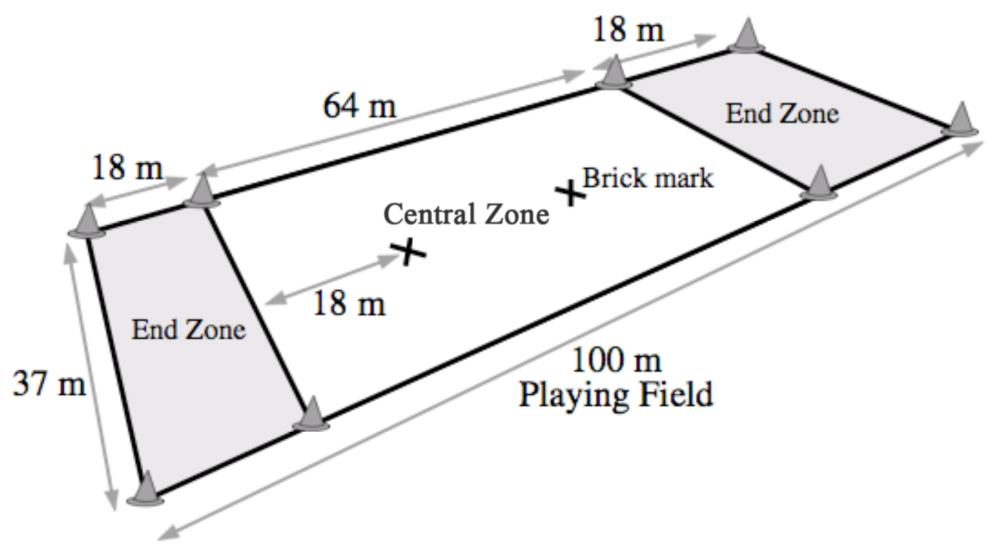

# WFDF Rulebook Images

Images extracted from the official rulebook PDF.

## Logo

- Format: jpeg
- Size: 6795 bytes
- Description: WFDF logo

## Field Diagram

- Format: jpeg
- Size: 37495 bytes
- Description: WFDF official field diagram showing dimensions: 64m central zone, 18m end zones, 37m width, 100m total length with brick marks
